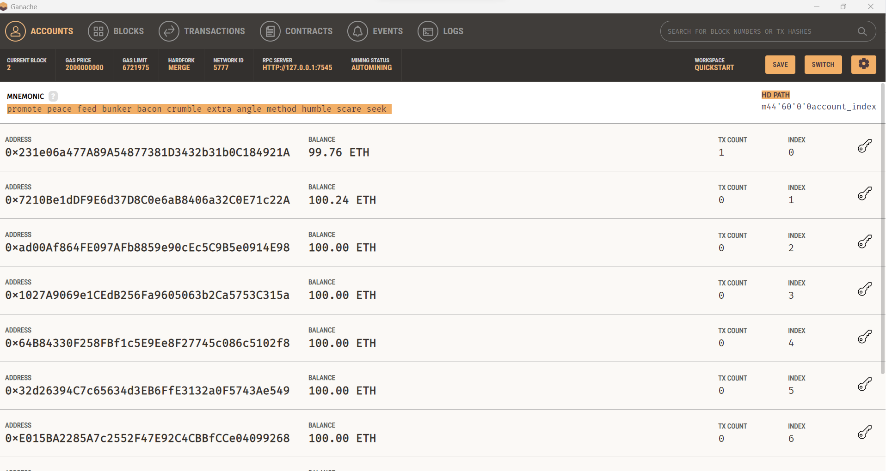
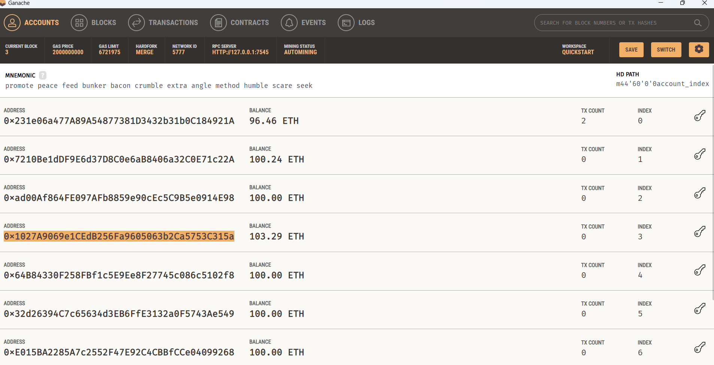
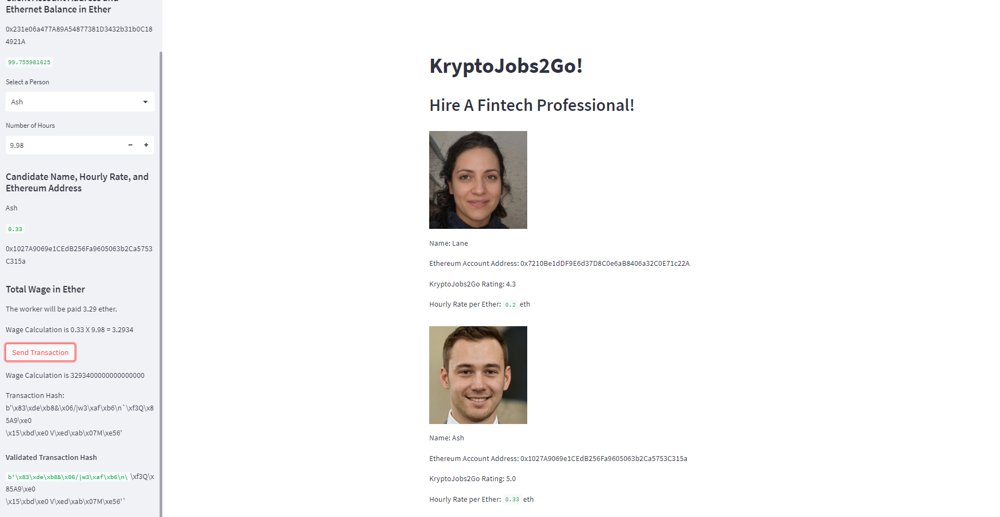

# Cryptocurrency-Wallet

In this Challenge, you will complete the code that enables your customers to send cryptocurrency payments to fintech professionals. To develop the code and test it out, you will assume the perspective of a KryptoJobs2Go customer who is using the application to find a fintech professional and pay them for their work.

A kryptoJobs2Go app that  enables customers to send cryptocurrency payments to fintech professionals. 

Two python files, krypto_jobs.py and crypto_wallet were used to automate the tasks associated with generating a digital wallet, accessing Etherum account balances, signing and sending transactions via a personal Ethereum blockchain called Ganache.
A .env file was used to store the Mnemonic key from Ganache.  

The steps are as follows: 
* Import Ethereum Transaction Functions into the KryptoJobs2Go Application
* Sign and Execute a Payment Transaction
* Inspect the Transaction on Ganache

screenshot of the Ganache inspection after completing the transaction:

Screenshot of hashed transaction

To launch the Streamlit application, type streamlit run krypto_jobs.py into the terminal that contains the folder.

